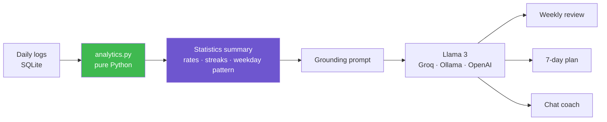

# 🎯 HabitLoop

**A habit tracker whose AI coach can only tell you things your own log actually says.**

[](https://python.org)
[](https://streamlit.io)
[](https://langchain.com)
[](https://llama.meta.com)
[](tests/test_analytics.py)
[](LICENSE)

Log habits → get a weekly review, a 7-day plan, and a coach you can ask questions — all grounded in your own history, running on open-weight models.

> Rebuilt and expanded from a project I originally put together for a community AI hackathon. Same idea, properly engineered: tested statistics, three swappable model backends, and a documented grounding design.

---

## The problem with AI habit coaches

Point an LLM at "be my habit coach" and it produces encouragement. It will tell you you're doing great, that consistency is key, that you should try habit stacking. None of it is about *you*, because none of it came from your data — and it reads the same whether you logged thirty days or three.

The failure is worse than useless, it's actively misleading: ask "how am I doing on meditation?" and a model with no grounding will confidently describe a streak you never had.

HabitLoop is built the other way round. **The model never sees your raw log, and it never does arithmetic.**

---

## The design



### Two decisions do all the work

**1. Statistics are computed in Python, never by the model.**

Streaks, completion rates and weekday breakdowns come out of [`habitloop/analytics.py`](habitloop/analytics.py) — pure functions over plain dicts, with [15 tests](tests/test_analytics.py) covering them.

Asking a language model to count consecutive days across 300 rows is asking it to do the single thing it's least reliable at. And it won't error — it'll return a plausible wrong number with total confidence, which is far harder to catch than a crash. So the model gets handed finished numbers and its only job is interpretation.

**2. Grounding is structural, not retrieval-based.**

There's no vector store here, and that's deliberate rather than a shortcut. A habit log is small — a few hundred rows. The *computed summary* fits in the context window many times over, so the coach receives the complete picture every turn and there is no retrieval step that can return the wrong thing.

RAG solves "the corpus doesn't fit." That problem doesn't exist at this scale, and adding retrieval anyway would mean an embedding model, a vector store and a new class of silent failures bought in exchange for nothing.

**What that buys:** the coach can be told *"every claim must trace to a number in this summary"* and the summary is genuinely the whole truth available. When you ask about a habit you never logged, it says the log doesn't cover it — because it can see that it doesn't.

### The prompt rule

Every one of the three prompts opens with the same block ([`habitloop/prompts.py`](habitloop/prompts.py)):

```
- Every claim you make must be traceable to a number in the summary below.
- Never invent a habit name, a date, a streak length or a percentage.
- If the summary does not contain enough data to answer, say so plainly.
  "You have only three days logged, so there isn't a pattern yet" is a correct
  and useful answer. A confident narrative built on three data points is not.
```

Temperature runs at 0.2–0.4. This app interprets numbers it was given; creativity here surfaces as fabricated detail about your own life, which is the one failure that matters.

---

## What it does

| | |
|---|---|
| 📝 **Log** | Mark habits done or missed, any date. Re-logging a day overwrites rather than duplicating. |
| 📊 **Progress** | Completion rates against your weekly target, current and longest streaks, per-weekday breakdown. |
| 🧠 **Weekly review** | What's working, what's slipping, one pattern you probably haven't spotted, one thing to change. Under 250 words, no motivational filler. |
| 📅 **7-day plan** | A day-by-day plan sized to your actual completion rates — a habit at 20% doesn't get a daily commitment. Weak weekdays get the lightest version. |
| 💬 **Coach** | Ask anything about your history. Questions the log can't answer, it declines. |

The Weekly review tab has a **"What the model actually receives"** expander showing the exact JSON. If the coach says something surprising, you can check whether the data supports it.

---

## Run it

```bash
git clone https://github.com/MohanVishe/ai-habit-tracker.git
cd ai-habit-tracker

python -m venv venv
source venv/bin/activate          # Windows: venv\Scripts\activate
pip install -r requirements.txt

cp .env.example .env              # add GROQ_API_KEY — free at console.groq.com
python seed.py                    # 60 days of sample data (optional)
streamlit run app.py
```

→ **http://localhost:8501**

### Choosing a backend

```bash
LLM_PROVIDER=groq     GROQ_MODEL=llama-3.3-70b-versatile    # default — open weights, free tier, fast
LLM_PROVIDER=ollama   OLLAMA_MODEL=llama3.1                 # fully local, nothing leaves the machine
LLM_PROVIDER=openai   OPENAI_MODEL=gpt-4o-mini              # for comparison
```

One env var, no code change. Ollama is the one to use if you'd rather your habit log never touch a third-party API — which is a reasonable thing to want from this particular category of data.

### Tests

```bash
pytest -q        # 15 passing
```

They cover the statistics, because those are what the model reports back as fact. Including the cases that are easy to get wrong: an unlogged *today* shouldn't break a streak (the day isn't over), a gap should, and two completions in thirty days is not 100%.

### Docker

```bash
docker build -t habitloop .
docker run -p 8501:8501 --env-file .env habitloop
```

---

## The sample data

`seed.py` generates 60 days that are deliberately uneven — a near-perfect habit, one that collapses at weekends, one abandoned after three weeks, one that barely happens. A seed where everything sits at 80% makes the analysis look good and demonstrates nothing.

Running it produces something like:

```
Morning walk            96.7%  streak 1/28
Read 20 pages           81.0%  streak 1/5
Deep work block         76.2%  streak 2/3
No screens after 10pm   36.7%  streak 2/2

weekend: Saturday {done: 5, missed: 11} · Sunday {done: 5, missed: 11}
```

That weekend collapse is the kind of thing the review is supposed to surface — and it's in the data, so it can.

---

## Layout

```
├── app.py                      # Streamlit UI — four tabs
├── habitloop/
│   ├── db.py                   # SQLite: schema and CRUD
│   ├── analytics.py            # pure statistics — the tested core
│   ├── llm.py                  # provider factory: Groq / Ollama / OpenAI
│   ├── prompts.py              # the grounding rule + three prompts
│   ├── insights.py             # weekly review, 7-day plan
│   └── coach.py                # grounded chat
├── tests/test_analytics.py     # 15 tests
├── seed.py                     # sample data
└── Dockerfile
```

---

## Limitations

- **Grounding is prompt-level plus structural, not enforced.** The model is given only true numbers and told to stay inside them, which removes the *opportunity* to hallucinate your history. It does not make it impossible — nothing validates the output against the summary before it reaches you. A post-generation check that every number in the response appears in the summary would close that, and it's the first thing I'd add.
- **Single user, local file.** No accounts, no sync. `data/habits.db` is gitignored.
- **30-day window is fixed** in the UI. The analytics functions take any window; the UI doesn't expose it yet.
- **A habit abandoned longer ago than the window disappears entirely** rather than being reported as dropped — arguably the more useful signal.
- **No reminders or notifications.** It tracks; it doesn't nag.
- **The coach has no memory across sessions.** Chat history lives in Streamlit session state and resets on reload.
- **Not a clinical tool.** The prompts explicitly refuse medical and psychiatric territory, but this is a habit log and nothing more.

## What I'd build next

1. **Output validation** — check every number in the model's response against the summary and flag anything that isn't there. Turns "grounded by construction" into "grounded and verified."
2. **An evaluation set** — questions with known correct answers from a fixed log, so changes to the prompts or a provider swap can be measured rather than eyeballed. Right now "it stays grounded" is an observation.
3. **Configurable window** and habit-level history charts.
4. **Correlation between habits** — does the walk happening predict the deep-work block happening? The data supports asking; the analytics don't compute it yet.
5. **Export** to CSV and Markdown.

## License

MIT — see [LICENSE](LICENSE).
