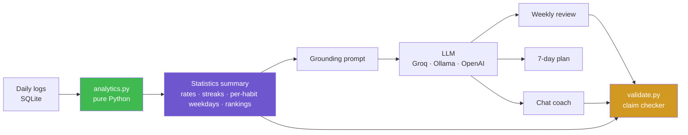

# 🎯 HabitLoop

**A habit tracker whose AI coach is only given statistics computed from your own log — and whose answers are checked against them.**

[](https://python.org)
[](https://streamlit.io)
[](https://langchain.com)
[](https://llama.meta.com)
[](https://github.com/MohanVishe/ai-habit-tracker/actions/workflows/tests.yml)
[](LICENSE)

Log habits → get a weekly review, a 7-day plan, and a coach you can ask questions — all grounded in your own history, running on open-weight models.

> Rebuilt and expanded from a project I originally put together for a community AI hackathon. Same idea, properly engineered: tested statistics, three swappable model backends, a documented grounding design and a claim checker on the output.

---

## The problem with AI habit coaches

Point an LLM at "be my habit coach" and it produces encouragement. It will tell you you're doing great, that consistency is key, that you should try habit stacking. None of it is about *you*, because none of it came from your data — and it reads the same whether you logged thirty days or three.

The failure is worse than useless, it's actively misleading: ask "how am I doing on meditation?" and a model with no grounding will confidently describe a streak you never had.

HabitLoop is built the other way round. **The model never sees your raw log, it never does arithmetic, and what it says back is checked against the numbers it was given.**

---

## The design


```mermaid
flowchart LR
    A["Daily logs<br/>SQLite"] --> B["analytics.py<br/>pure Python"]
    B --> C["Statistics summary<br/>rates · streaks · per-habit weekdays · rankings"]
    C --> D["Grounding prompt"]
    D --> E["LLM<br/>Groq · Ollama · OpenAI"]
    E --> F["Weekly review"]
    E --> G["7-day plan"]
    E --> H["Chat coach"]
    F --> V["validate.py<br/>claim checker"]
    H --> V
    C --> V

    style B fill:#3fb950,color:#fff
    style C fill:#6E56CF,color:#fff
    style V fill:#d29922,color:#fff
```

### Three decisions do the work

**1. Statistics are computed in Python, never by the model.**

Streaks, completion rates, per-habit weekday breakdowns and best/worst rankings come out of [`habitloop/analytics.py`](habitloop/analytics.py) — pure functions over plain dicts, tested in [`tests/test_analytics.py`](tests/test_analytics.py).

Asking a language model to count consecutive days across 300 rows is asking it to do the single thing it's least reliable at. And it won't error — it'll return a plausible wrong number with total confidence, which is far harder to catch than a crash. So the model gets handed finished numbers — including the *order* of habits for "which is worst at weekends?" — and its job is interpretation.

What the numbers mean:

- **Completion** is done days ÷ the weekly target scaled to the days the habit has existed inside the 30-day window. A habit added three days ago and done all three days is 100%, not 10%.
- **Current streak** counts back from today. Today not yet logged doesn't break it (the day isn't over); a miss logged today does — the streak is 0.
- **Weekday pattern** is per habit: for each weekday, done / missed / how many of that weekday fell in the period, plus Sat+Sun and Mon–Fri totals.
- **Archived habits** are left out of Progress and out of the summary.

**2. Grounding is structural, not retrieval-based.**

There's no vector store here, and that's deliberate rather than a shortcut. A habit log is small — a few hundred rows. The *computed summary* fits in the context window many times over, so the coach receives the complete picture every turn and there is no retrieval step that can return the wrong thing.

RAG solves "the corpus doesn't fit." That problem doesn't exist at this scale, and adding retrieval anyway would mean an embedding model, a vector store and a new class of silent failures bought in exchange for nothing.

**3. The output is checked, claim by claim.**

[`habitloop/validate.py`](habitloop/validate.py) runs over every coach answer and every weekly review. The UI shows "Checked N number(s) against the summary: all supported" or a warning listing what isn't. What it enforces is set out exactly below.

### The prompt rule

Every one of the three prompts opens with the same block ([`habitloop/prompts.py`](habitloop/prompts.py)), which also explains what each field in the summary means:

```
- Every claim you make must be traceable to a number in the summary below.
- Never invent a habit name, a date, a streak length or a percentage.
- If the summary does not contain enough data to answer, say so plainly.
  "You have only three days logged, so there isn't a pattern yet" is a correct
  and useful answer. A confident narrative built on three data points is not.
- Attach each number to the habit and the part of the week it belongs to. A
  habit's total misses are not its weekend misses.
```

Temperature runs at 0.2–0.4. This app interprets numbers it was given; creativity here surfaces as fabricated detail about your own life, which is the one failure that matters.

---

## Grounding: what is enforced and what isn't

Checking only that "every number in the answer appears somewhere in the summary" catches very little: a 30-day summary contains almost every small integer, so a habit's 20 total misses reported as its *weekend* misses passes. The checker therefore works on claims — a number, the habit it's attached to, and the part of the week it's about.

**Enforced (flagged in the UI, covered by [`tests/test_validate.py`](tests/test_validate.py)):**

- **Every number is checked in context.** The habit is the one named in the clause, or the last one named (so "It dropped to 20%" still refers to it). A clause about weekends, weekdays or a named day is checked against that habit's weekday figures; otherwise against its overall figures (completion counts, rate, target, streaks). "Weekends" means the Sat+Sun totals, not either day alone.
- **Current vs longest streak.** A number right after "current streak" must be the current streak.
- **Rates.** 66.7%, 67% and 0.667 all match a rate of 0.667 (half a point of rounding); a whole number matches a count exactly.
- **Best/worst claims about one habit** ("Deep work block is your worst habit at weekends") must name the habit with the lowest (highest) rate in that context; ties are allowed.
- Window-level numbers (window length, entry count, habit count) are allowed anywhere. Dates, list numbering, digits inside habit names ("Read 20 pages"), times of day and durations are not treated as claims.

**Not enforced:**

- Numbers written as words ("once every eight days").
- Claims with no number: "you met your target", "a perfect record on weekdays", "even lower than" comparisons between two figures or two named habits.
- Invented habit names, and anything in the 7-day plan (its day numbers and dates aren't statistics).
- Dates written out ("August 27, 2026"): only ISO dates are skipped, so the day and year can be flagged as unsupported numbers.
- Ambiguous wording that the rules can't pin down — "maintained a streak of 28 days" with no "current" or "longest" is accepted if 28 is either.

The checker flags; it doesn't rewrite or block the answer. It is rule-based, so it can also flag a correct sentence whose wording it misreads — the warning names the number, the habit and the context it checked, so you can see why.

### A live run

[`scripts/live_check.py`](scripts/live_check.py) seeds the fixed sample log, asks the coach four questions (including the UI's own placeholder, "Which habit am I worst at on weekends?") and requests a weekly review, then runs the checker on each answer. One run with **qwen2.5:7b-instruct via Ollama**, 2026-09-26, is committed as [`examples/live_check_qwen2.5-7b-instruct.txt`](examples/live_check_qwen2.5-7b-instruct.txt). In that run the coach named Deep work block as worst at weekends (0.0, correct per the summary's rankings), declined the meditation and feelings questions, and the checker flagged nothing. The review's "maintained a streak of 28 consecutive days" (28 is the longest, the current streak is 1) was not flagged: it is the ambiguous-wording case listed above.

This is one run of one model on one log, a spot check; the measured error rate is in the next section. Earlier runs while building this surfaced three kinds of error that are now unit tests: a wrong "worst at weekends" with every number correct, a longest streak reported as the current one, and a single day's rate quoted as the weekend rate.

---

## Measured accuracy

[`eval/`](eval/) asks the coach a fixed set of 51 questions about three seeded logs (`seed.py` ending 2026-08-02, 2026-09-15 and 2026-09-25), 153 answers in all, and scores each against the statistics computed in Python. No model grades anything.

**qwen2.5:7b-instruct via Ollama, 2026-09-26:**

| | |
|---|---|
| Correct, including correct refusals | **119 / 153 = 77.8%** (Wilson 95% 70.6–83.6%) |
| Error rate | **22.2%** (Wilson 95% 16.4–29.4%; resampling whole questions, 12.4–33.3%) |

| Question type | Correct |
|---|---|
| Per-habit rates and counts (completion rate, days done, days missed, habits tracked) | 27 / 27 |
| Unanswerable or out of scope (a habit not in the window, sleep, feelings, 90 days, a forecast, a medical question) | 24 / 24 declined |
| Current vs longest streak | 27 / 30 |
| Weekday vs weekend (rates, and "weekdays or weekends?") | 26 / 30 |
| Which day of the week | 12 / 24 |
| Best / worst habit | 3 / 18 |

**Where it goes wrong.** Reading a number out of the summary is reliable; comparing habits or days is not. 20 of the 33 wrong answers are lists that start with the right habit or day and add a wrong one ("No screens after 10pm | Deep work block" for the single worst habit); scored on the first name only, 139 / 153 (90.8%) would be correct. The rest are wrong picks, invented rates (a weekend rate of 0.0 for Morning walk, which is 1.0 and 0.875 on those logs), and four "weekdays or weekends?" answers that contradict the rates quoted in the same reply. It declined one answerable question and answered none of the unanswerable ones.

**What the validator catches**, run on each answer's explanation:

- It flagged **17 of the 33 wrong answers** (Wilson 95% 35–67%). Read by hand ([`flag-review.json`](eval/results/qwen2.5-7b-instruct.flag-review.json)), 11 of those flags point at the actual error; 6 fire on something else in the sentence, such as a correct weekend rate in a sentence that doesn't say "weekend".
- It flagged all 11 wrong which-day answers (8 of them for the right reason). The 16 wrong answers it missed are all comparisons: 11 best/worst lists, 3 weekday-vs-weekend conclusions that contradict their own numbers, 2 streak rankings. It checks best/worst claims about one habit, not claims about two, and a number given for "both" habits passes if either has it.
- It flagged **9 of the 95 correct answers** (Wilson 95% 5–17%). By hand: 6 misreads (dates written out, "weekdays" meaning days of the week, a superlative across days read as across habits), 2 arguable, 1 a real false side claim in an otherwise correct answer. It also flagged 3 of the 24 correct refusals, on the "90" taken from the question.

**How it's scored.** Each question gets a format instruction appended: first line `ANSWER: <value>` (or `ANSWER: UNKNOWN`), then one sentence of explanation. The value is scored by a fixed rule per answer type: counts and streaks must match exactly; rates within 0.005 (0.667, 66.7% and 67% all match 0.667); every habit or day named must be in the true set (naming one of several tied is fine); "weekdays", "weekends" or "equal" for the choice questions. The full rule is at the top of [`eval/scoring.py`](eval/scoring.py), with unit tests for each. The expected answer for every question is read from `analytics.build_summary` for that log, and a test cross-checks it against the individual analytics functions. The validator sees the explanation, not the bare `ANSWER:` line, which has no habit or part of the week beside it to check against.

**Setup.** `qwen2.5:7b-instruct` (Q4_K_M, digest `845dbda0ea48`) on Ollama 0.34.2, through the app's own chat path (`habitloop.coach.answer` with `LLM_PROVIDER=ollama`) at the coach's temperature of 0.2, with `OLLAMA_SEED=42`. Context was 4,096 tokens; the largest prompt plus answer was 2,936. A second identical run ([`.repeat`](eval/results/qwen2.5-7b-instruct.repeat.summary.json)) gave the same text for 141 of 153 answers; the other 12 changed wording only, and every outcome and validator verdict was the same.

**Limits.**

- The logs are synthetic: one seeded generator, four habits in the window. Real logs are messier.
- One model, one seed.
- The questions, the scoring rules and the validator were all written by the same author, so they may share blind spots.
- The format instruction makes answers scoreable, but it is not how the chat tab is used. Free-form answers may do better or worse.
- The same 51 questions are asked of three logs, so the 153 answers are not independent. That is why the question-level interval is wider.

```bash
python -m eval.run              # ask the model (Ollama with the model pulled), then score
python -m eval.run --rescore    # re-score the committed responses offline; a test does the same
```

Raw answers with their scores: [`eval/results/qwen2.5-7b-instruct.jsonl`](eval/results/qwen2.5-7b-instruct.jsonl). Summary: [`qwen2.5-7b-instruct.summary.json`](eval/results/qwen2.5-7b-instruct.summary.json).

---

## What it does

| | |
|---|---|
| 📝 **Log** | Mark habits done or missed, any date. Re-logging a day overwrites rather than duplicating. |
| 📊 **Progress** | Completion rates against your weekly target, current and longest streaks, the share of each weekday done per habit. |
| 🧠 **Weekly review** | What's working, what's slipping, one pattern you probably haven't spotted, one thing to change. Under 250 words, no motivational filler. Checked by the validator. |
| 📅 **7-day plan** | A day-by-day plan sized to your actual completion rates — a habit at 20% doesn't get a daily commitment. Weak weekdays get the lightest version. |
| 💬 **Coach** | Ask about your history. The model is told to decline what the summary doesn't cover; each answer is checked. |

The Weekly review tab has a **"What the model actually receives"** expander showing the exact JSON. If the coach says something surprising, you can check whether the data supports it.

---

## Run it

Python 3.11–3.13 (tested in CI).

```bash
git clone https://github.com/MohanVishe/ai-habit-tracker.git
cd ai-habit-tracker

python -m venv venv
source venv/bin/activate          # Windows: venv\Scripts\activate
pip install -r requirements.txt   # runtime: exact pins for every package, exported from uv.lock

cp .env.example .env              # add GROQ_API_KEY — free at console.groq.com
python seed.py                    # 60 days of sample data ending today (optional)
streamlit run app.py
```

Or with [uv](https://docs.astral.sh/uv/): `uv sync --locked`, then `uv run streamlit run app.py`.

Both requirements files are generated from `uv.lock`, and CI fails if either drifts from it:

```bash
uv export --frozen --no-hashes --no-emit-project --no-dev -o requirements.txt           # runtime (what the Docker image installs)
uv export --frozen --no-hashes --no-emit-project --all-groups -o requirements-dev.txt   # runtime + pytest
```

→ **http://localhost:8501**

### Choosing a backend

```bash
LLM_PROVIDER=groq     GROQ_MODEL=llama-3.3-70b-versatile    # default — open weights, free tier, fast
LLM_PROVIDER=ollama   OLLAMA_MODEL=llama3.1                 # fully local, nothing leaves the machine
LLM_PROVIDER=openai   OPENAI_MODEL=gpt-4o-mini              # for comparison
```

One env var, no code change; every model id is an env var too. `llama-3.3-70b-versatile` is listed as a production model on [Groq's models page](https://console.groq.com/docs/models) and is not on its [deprecations page](https://console.groq.com/docs/deprecations) (both checked 2026-09-26). Ollama is the one to use if you'd rather your habit log never touch a third-party API — which is a reasonable thing to want from this particular category of data. Any chat model Ollama serves works; the live run above used `qwen2.5:7b-instruct`.

### Tests

```bash
pip install -r requirements-dev.txt   # the runtime pins plus pytest (or: uv sync --locked)
pytest -q                             # 123 passing, no model or network needed
```

- `test_analytics.py` — the statistics: streak edge cases (an unlogged today doesn't break a streak, a miss logged today does, a gap does), start-date-aware completion (3/3 on a new habit is 100%; two completions in thirty days is not), per-habit weekday totals, rankings.
- `test_validate.py` — the claim checker: what passes, what is flagged, including the errors seen from a live model.
- `test_db_and_seed.py` — archived habits leave the summary, `created_on` reaches the denominator, the seed is deterministic, and the README's sample block below is exactly what `seed.py` prints.
- `test_eval_scoring.py` — the evaluation: expected answers cross-checked against the analytics functions, the answer parser, every scoring rule, the interval code, and that re-scoring the committed responses reproduces the committed summary.
- `test_app.py` — runs `app.py` headless with Streamlit's AppTest: all four tabs render, archiving removes a habit from Progress, and a missing API key gives a readable message rather than a traceback.

CI runs these on Python 3.11, 3.12 and 3.13 after `pip install -r requirements-dev.txt`, again from `uv sync --locked`, and builds the Docker image, checks pytest is not in it, and waits for its healthcheck.

### Docker

```bash
docker build -t habitloop .
docker run -p 8501:8501 --env-file .env habitloop
```

The image installs `requirements.txt` only, the runtime dependencies without the test tooling. The healthcheck uses Python's standard library (the slim base image has no curl).

---

## The sample data

`seed.py` generates 60 days that are deliberately uneven — a near-perfect habit, two that collapse at weekends, one abandoned after three weeks, one that barely happens. A seed where everything sits at 80% makes the analysis look good and demonstrates nothing.

The draws are seeded, so a fixed end date gives the same log on any machine and any day:

```bash
python seed.py --as-of 2026-09-15 --db data/example.db
```

prints

```
Seeded 5 habits, 60 days ending 2026-09-15 (Tuesday). Last 30 days:

Morning walk            96.7%  streak 1/28  weekends  8/8 done
Read 20 pages           81.0%  streak 1/5   weekends  1/8 done
Deep work block         76.2%  streak 2/3   weekends  0/8 done
No screens after 10pm   36.7%  streak 2/2   weekends  1/8 done

Run: streamlit run app.py
```

(streak is current/longest in the window; a test keeps this block in step with the code.) Plain `python seed.py` ends the log today, so its numbers shift with the weekday. Meditate doesn't appear: it was abandoned before the 30-day window — see Limitations.

The weekend collapse in Read 20 pages and Deep work block is the kind of thing the review is supposed to surface — and it's in the per-habit data, so it can. Part of it is by design: those two habits target 5×/week, and the seed logs their weekends as misses.

---

## Layout

```
├── app.py                      # Streamlit UI — four tabs
├── habitloop/
│   ├── db.py                   # SQLite: schema and CRUD ($HABITLOOP_DB overrides the path)
│   ├── analytics.py            # pure statistics — the tested core
│   ├── validate.py             # claim checker for model output
│   ├── llm.py                  # provider factory: Groq / Ollama / OpenAI
│   ├── prompts.py              # the grounding rule + three prompts
│   ├── insights.py             # weekly review, 7-day plan
│   └── coach.py                # grounded chat
├── tests/                      # analytics, validator, storage + seed, app smoke test
├── eval/                       # question set, scorer, runner and committed results
├── scripts/live_check.py       # coach + review against the sample log, checked
├── examples/                   # committed output of a live_check run
├── seed.py                     # sample data
├── pyproject.toml, uv.lock     # dependencies; requirements*.txt are exported from the lock
└── Dockerfile
```

---

## Limitations

- **The claim checker is rule-based.** It covers numbers and best/worst claims in context; the list of what it doesn't cover is above. It flags rather than blocks. On the eval it flagged 17 of 33 wrong answers and 9 of 95 correct ones.
- **The coach is weak at comparisons.** On the eval, best/worst habit answers were right 3 times in 18 and which-day answers 12 times in 24, against 27 of 27 for single per-habit figures.
- **Streaks are daily.** A 5×/week habit's streak resets at a skipped weekend even when the weekly target is met.
- **A habit with no entries in the window disappears** rather than being reported as dropped (Meditate in the sample data) — arguably the more useful signal.
- **30-day window is fixed** in the UI. The analytics functions take any window; the UI doesn't expose it yet.
- **Single user, local file.** No accounts, no sync. `data/` is gitignored.
- **The coach has no memory across sessions.** Chat history lives in Streamlit session state and resets on reload.
- **No reminders or notifications.** It tracks; it doesn't nag.
- **Not a clinical tool.** The prompts explicitly refuse medical and psychiatric territory, but this is a habit log and nothing more.

## Next

1. **Close the gaps the eval measures**, then re-run it: best/worst and which-day answers (3/18 and 12/24), e.g. a precomputed best and worst weekday per habit and explicit ties in the rankings; checker coverage for claims about two habits at once, dates written out and numbers written as words.
2. **Widen the eval**: the default Groq Llama 3.3 70B (not yet run), hand-written logs, questions written by someone else, and free-form answers.
3. **Weekly-target streaks** for habits below 7×/week, and reporting abandoned habits as dropped.
4. **Configurable window** and habit-level history charts.
5. **Correlation between habits** — does the walk happening predict the deep-work block happening? The data supports asking; the analytics don't compute it yet.

## Credits

- Default model: Meta **Llama 3.3 70B** (served by Groq), under the [Llama 3.3 Community License](https://github.com/meta-llama/llama-models/blob/main/models/llama3_3/LICENSE).
- Live-run example and evaluation: **Qwen2.5-7B-Instruct** (via Ollama), Apache 2.0.

## License

MIT — see [LICENSE](LICENSE).
